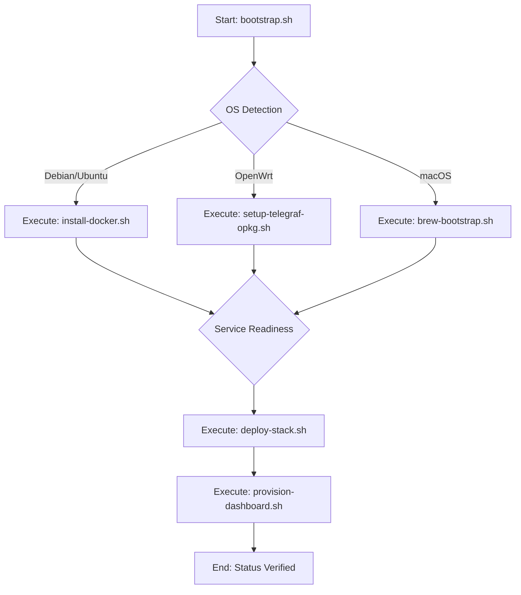

# Deep Dive: Bootstrap Script (`bootstrap.sh`)

The `bootstrap.sh` script is the foundational entry point for the `monitoring-stack` deployment. It is engineered for high-availability environments and heterogeneous host fleets, prioritizing idempotency and fail-fast behavior.

## Architecture & Logic Flow

### 1. OS Detection Logic
The script probes the host environment by checking standard release files. If `OSTYPE` is undefined, it falls back to:
- `/etc/debian_version` for Debian-family distributions.
- `/etc/openwrt_release` for OpenWrt embedded systems.
- The `uname` output to differentiate between macOS/Darwin and standard Linux distributions.

### 2. Security & Permissions
The script enforces strict permission checks:
- **Root/sudo Enforcement**: The script checks `$EUID`. If not 0, it logs a critical error and exits, ensuring Docker and systemd operations are performed with necessary privileges.
- **File Permissions**: Before execution, it runs `find docs/scripts/ -type f -name "*.sh" -exec chmod +x {} \;` to ensure all orchestration binaries are executable, mitigating permission drift.

### 3. Idempotency & Recovery
- The script checks for the presence of existing configuration in `/etc/monitoring-stack/` before overwriting.
- If a phase fails, logs are written to `/var/log/monitoring-bootstrap.log`. The design allows re-running specific components independently of the main orchestrator.

## Configuration Requirements
- **Network**: Direct access to `download.docker.com` and repository mirrors is required.
- **Dependencies**: Must have `curl`, `git`, and `jq` (for JSON processing) installed on the base image.
- **Resource Constraints**: Minimum 512MB RAM available for agent installation.
