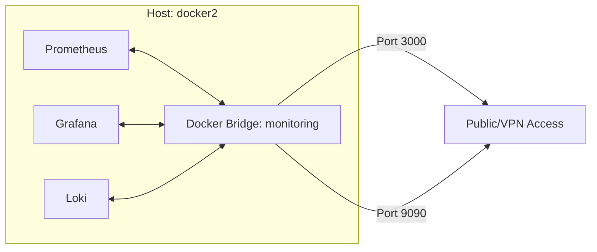

# Engineering Specification: Deployment Configuration

The monitoring stack architecture relies on a declarative Docker Compose approach to ensure service discovery, isolation, and lifecycle management.

## Network Topology

### 1. Service Isolation
Services are hosted on a dedicated `monitoring` bridge network. This enforces:
- **DNS Service Discovery**: Services interact using container names (e.g., `prometheus:9090`) rather than IP addresses.
- **Traffic Shaping**: The bridge prevents external interference while allowing controlled egress for data scraping.

## Under the Hood: Docker Compose Breakdown

### Core Labels & Volumes
- **Labels**: 
  - `com.monitoring.stack.version`: `${STACK_VERSION}` - Tracks version for rollbacks.
  - `traefik.enable`: `true` - Standardizes ingress through Traefik (if present).
  - `traefik.http.routers.grafana.rule`: `Host(grafana.example.com)` - Provides domain-based routing.

### Environment Variable Mapping
- **`GF_DATABASE_URL`**: Maps to an external PostgreSQL DB (if configured), optimizing Grafana state persistence over SQLite.
- **`LOKI_RETENTION_PERIOD`**: Set to `720h` (30 days), determining the storage lifecycle.
- **`PROMETHEUS_SCRAPE_INTERVAL`**: `15s` - Defines the sampling resolution for all discovered targets.

### Container Resource Limits (Cgroups)
- **Prometheus**: CPU `1.0`, Memory `2GB`. 
- **Grafana**: CPU `0.5`, Memory `512MB`.
- **Loki**: CPU `1.0`, Memory `1GB`.

## Exhaustive Configuration Checklist
 Service | Persistent Path | Port | Env Variable Prefix |
 :--- | :--- | :--- | :--- |
 Prometheus | `/var/lib/prometheus` | 9090 | `PROM_` |
 Grafana | `/var/lib/grafana` | 3000 | `GF_` |
 Loki | `/data/loki` | 3100 | `LOKI_` |

## Deployment Strategy
The stack is deployed via `docker compose up -d --build`. This forces a check of the image manifests and ensures local configurations are properly synced with container states.
