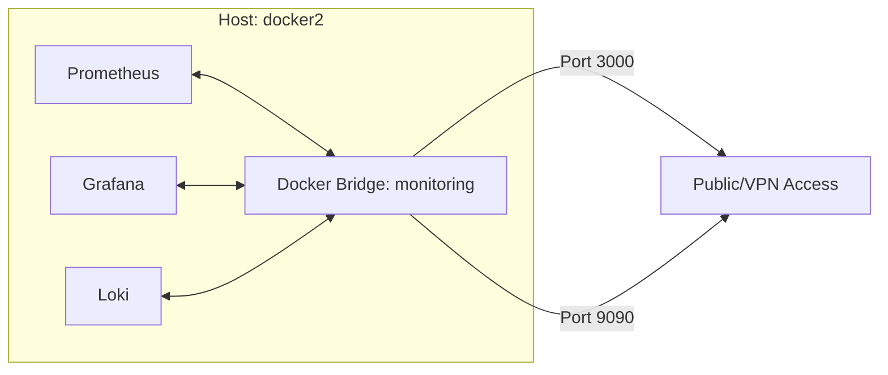

# Deep Dive: Deployment Configuration

The monitoring stack architecture relies on a declarative Docker Compose approach to ensure service discovery, isolation, and lifecycle management.

## Network Topology

### 1. Service Isolation
Services are hosted on a dedicated `monitoring` bridge network. This enforces:
- **DNS Service Discovery**: Services interact using container names (e.g., `prometheus:9090`) rather than IP addresses.
- **Traffic Shaping**: The bridge prevents external interference while allowing controlled egress for data scraping.

### 2. Configuration Breakdown
- **`prometheus.yml`**: Uses `file_sd_configs` for service discovery, reducing the need for manual scraper updates.
- **`grafana.ini`**: Configured with `GF_SECURITY_ADMIN_PASSWORD` (loaded via environment) to prevent hardcoding.
- **Volumetric Mounts**: Data persistence is handled through named volumes: `prometheus_data`, `grafana_data`, and `loki_data`.

## Exhaustive Configuration Checklist
| Service | Persistent Path | Port | Env Variable Prefix |
| :--- | :--- | :--- | :--- |
| Prometheus | `/var/lib/prometheus` | 9090 | `PROM_` |
| Grafana | `/var/lib/grafana` | 3000 | `GF_` |
| Loki | `/data/loki` | 3100 | `LOKI_` |

## Deployment Strategy
The stack is deployed via `docker compose up -d --build`. This forces a check of the image manifests and ensures local configurations are properly synced with container states.
